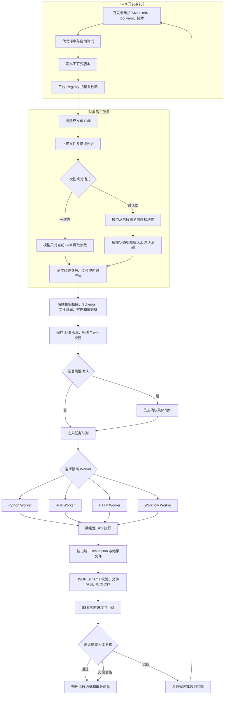
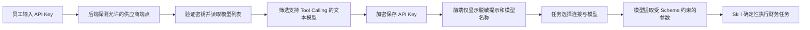

# 财务 Skill 平台架构

## 设计原则

- 大模型负责理解自然语言、补全受限参数和解释结果。
- Skill 负责财务计算、Excel 修改、RPA 和内部 API 调用。
- 用户每次运行都绑定 Skill 版本、内容哈希和只读快照，避免代码更新污染历史任务。
- 普通员工可运行已发布 Skill；只有 `skill_admin` 可维护和发布 Skill。
- 写入 ERP、提交凭证、发送外部邮件等动作必须由 Skill 声明风险并在执行前确认。

## 完整业务流程



## 运行状态

```text
waiting_confirmation
        ↓
      queued → running → waiting_user_action → running
                    └──→ succeeded / failed / timed_out / cancelled
```

## 当前实现

- FastAPI：接口、权限、文件、任务与 SSE。
- SQLite：第一期运行记录、文件元数据和事件；生产可切 PostgreSQL。
- 独立 Worker：轮询数据库队列，按 `python`、`rpa`、`http`、`workflow` 池领取任务。
- 对话式执行器：会话、消息和动作独立留痕；状态机限制每阶段可调用动作，
  耗时动作由 `workflow` Worker 执行。
- React：Skill 目录、参数解析、任务提交、实时进度、结果下载和管理员页面。
- Skill Registry：扫描 `skills/*/tool.yaml`，也可配置外部 Git 工作树。
- Model Connections：API Key 自动探测、加密保存、模型发现和任务级模型选择。

## 模型接入流程



凭据密文保存在 SQLite，Fernet 主密钥位于 `data/credential.key`，两者都不进入
Git。生产环境应把主密钥迁移到公司密钥管理系统，并限制数据库和数据目录权限。

## 下一阶段

- PostgreSQL + Redis/Celery，支持多实例和可靠重试。
- Docker/Windows Sandbox 隔离 Python 与 RPA Worker。
- 接入公司 SSO/LDAP，替换当前演示身份头。
- Git Webhook 拉取批准版本，并增加签名、病毒扫描与依赖白名单。
- 增加审批流、审计导出、保留周期和数据脱敏策略。
