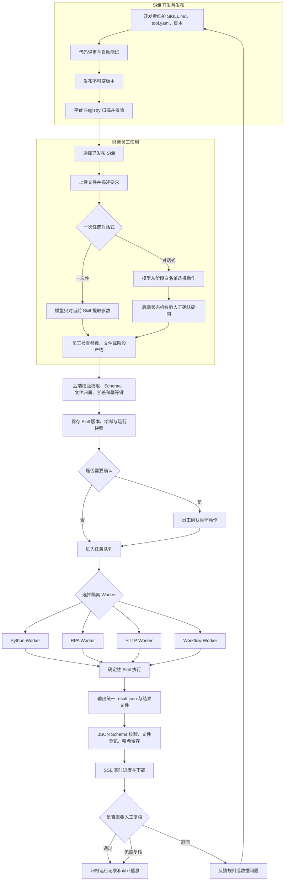

# 财务 Skill 平台架构

## 设计原则

- 大模型负责理解自然语言、补全受限参数和解释结果。
- Skill 负责财务计算、Excel 修改、RPA 和内部 API 调用。
- 用户每次运行都绑定 Skill 版本、内容哈希和只读快照，避免代码更新污染历史任务。
- 普通员工可运行已发布 Skill；只有 `skill_admin` 可维护和发布 Skill。
- 写入 ERP、提交凭证、发送外部邮件等动作必须由 Skill 声明风险并在执行前确认。

## 完整业务流程



## 运行状态

```text
waiting_confirmation
        ↓
      queued → running → waiting_user_action → running
                    └──→ succeeded / failed / timed_out / cancelled
```

## 当前实现

- FastAPI：接口、权限、文件、任务与 SSE。
- SQLite：第一期运行记录、文件元数据和事件；生产可切 PostgreSQL。
- 独立 Worker：按 `python`、`rpa`、`http`、`workflow` 池分别启动多个进程并轮询
  数据库队列。领取阶段由数据库全局调度锁串行化，执行阶段并行。
- 对话式执行器：会话、消息和动作独立留痕；状态机限制每阶段可调用动作，
  耗时动作由 `workflow` Worker 执行。
- 多日期批次：`WorkflowBatch` 保存日期集合和整体状态，每个日期仍对应一个
  `WorkflowSession`。同一批次严格串行；成功子任务输出的两份工作副本通过受控
  `FileRecord` 绑定传递给下一日。失败时不启动后续日期，准备阶段失败可从该日期继续。
- 并发控制：任务快照保存 `runtime.concurrency_limit`，Worker 领取前统计同 Skill
  有效租约；达到上限时跳过该任务并继续寻找其他 Skill。
- 执行租约：Worker 领取时写入 `worker_id`、`attempt_count`、心跳和租约到期时间。
  执行期间独立心跳续租；只读标准任务可在租约过期后有限重排，高风险写入和
  Workflow Action 失败后必须人工检查，防止重复写入。
- 本地 SQLite 使用 WAL、30 秒 busy timeout 和 `BEGIN IMMEDIATE` 完成原子领取；
  PostgreSQL 使用 `scheduler_locks` 行锁。多机正式部署推荐 PostgreSQL。
- 对话上下文：数据库保存完整消息；每次请求向模型发送稳定系统规则、结构化工作流
  状态和最近 20 条消息。模型可直接自然回复，只有明确推进任务时才调用当前阶段工具。
- 自然语言中出现“开始、停止、确认写入”等词不会自动执行；本地确定性规则只接受
  明确指令，写入确认还需后端二次校验最新用户原话。
- Next.js：`web/` 是当前维护的用户界面，服务端 BFF 通过同源请求访问 FastAPI；生产由
  Next.js 容器提供页面，FastAPI 的静态目录只保留兼容性的可选回退。
- Skill Registry：扫描 `skills/*/tool.yaml`，也可配置外部 Git 工作树。
- Model Connections：API Key 自动探测、加密保存、模型发现和任务级模型选择。浏览器只保存
  Clerk 会话状态；FastAPI 按显式 `session`、`hybrid` 或 `clerk` 模式核验平台用户，平台本地
  角色、部门和 Skill 权限始终由数据库决定。

## 任务材料、确认与结果口径

每个 Workflow 或 Pi Harness 任务在创建时固定执行方式、Skill 快照、业务日期和材料版本。
应收核销取数优先使用版本化的 Fetched Bundle；开发或测试环境的快照回放仍需通过当前用户
自己的材料和权限校验。模型只能看到统一处理后的任务上下文、结构化取数预览和受限文件页，
解析失败的内容不会作为原文返回。

写入动作继续由确定性 Workflow Worker 执行。创建授权、取数检查、写前校验和必要的人工
确认分别对应实际状态机阶段；没有实际审批阶段的任务不会在员工页面显示额外审批提示。写入
使用隔离副本，并执行回读和发布检查；写入失败或执行租约中断不自动重试。多日期批次按日期
升序串行处理，前一天成功回读后下一天才使用新的材料版本。

工作台、任务中心和运行观测使用统一的任务展示口径：普通 Run、独立核销日期任务和核销批次
各计一次，批次子任务不重复计数。统计响应标明部门或账号范围以及时间窗口；步骤和模型耗时
指标仍表示有对应记录的普通 Run。

文件列表的删除保护和详情展示使用同一套引用判断。业务材料版本通过关系表直接查询；任务、
工作流动作和旧记录中的 JSON 引用会先按当前页文件 ID 做有界查询，再解析命中的记录。历史
JSON 无法解析或历史登记不完整时按仍被引用处理，因此不会因为索引缺少记录就允许删除。后续
如需把所有引用迁移到统一登记表，应另行提供迁移、历史回填和回退方案；当前源码没有执行
数据库迁移或批量回填，也没有用一次性读取全部历史记录来掩盖查询成本。

## 模型接入流程


凭据密文保存在 SQLite，Fernet 主密钥位于 `data/credential.key`，两者都不进入
Git。生产环境应把主密钥迁移到公司密钥管理系统，并限制数据库和数据目录权限。

## 下一阶段

- PostgreSQL + Redis/Celery，支持多实例和可靠重试。
- Docker/Windows Sandbox 隔离 Python 与 RPA Worker。
- 接入公司 SSO/LDAP，替换当前演示身份头。
- Git Webhook 拉取批准版本，并增加签名、病毒扫描与依赖白名单。
- 增加审批流、审计导出、保留周期和数据脱敏策略。
